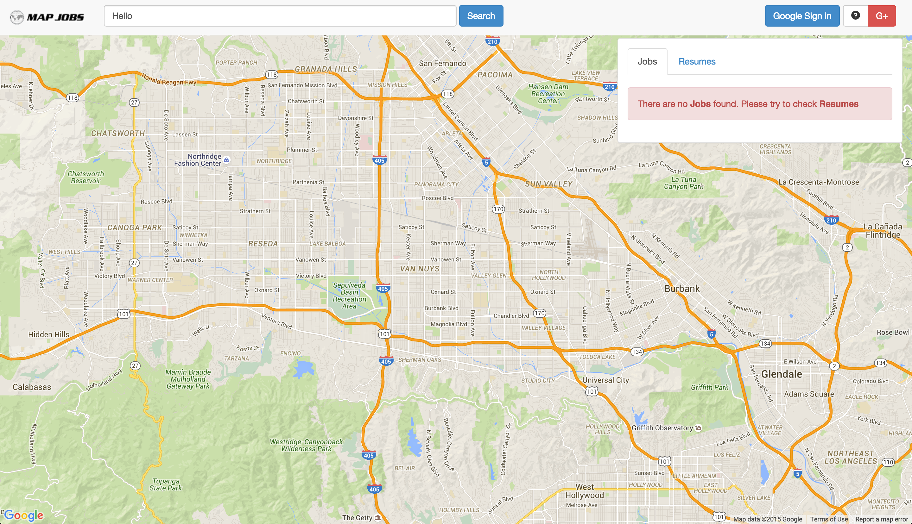

# Mapjobs

Mapjobs is an application with the purpose of finding jobs using a modified Google Maps API. The database is stored using Google Datastore.

Here's are some important link:

- [Mapjobs](http://gcdc2013-mapjobs.appspot.com/)
- [Google Plus Page](https://plus.google.com/+Gcdc2013mapjobsAppspotAI)
- [MapJobs Wiki](https://sites.google.com/a/asteriainteractive.com/map-jobs/)

## Screenshot

## List of Demo Keyword Searches

- Google
- University of CA Riverside
- City of Riverside
- Accountant
- Bookkeeper
- Creative Technical Consultant
- Front End Software Engineer
- Web Developer, Internal Tools And Web Applications (Python)
- Web Developer Tech Lead, Internal Tools And Web Applications

**Note:** The keyword must be precise, otherwise it will not pull up any information.